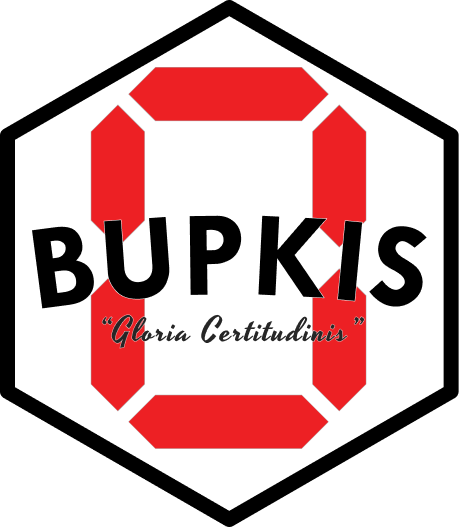

<p align="center">
  
  <h1 align="center"><span class="bupkis">⁓ BUPKIS ⁓<span></h1>
  <p align="center">
    Uncommonly extensible assertions for the beautiful people
    <br/>
    <small>by <a href="https://github.com/boneskull">@boneskull</a></small>
  </p>
</p>

## Quick Links

- [BUPKIS' Homepage][docs] (<https://bupkis.zip>)
- [Assertion Reference][assertion-reference]
- [Guide: Basic Usage][basic-usage]
- [Guide: Creating a Custom Assertion][create-a-custom-assertion]

## Motivation

> "_Another_ assertion library? You cannot be serious. My test framework has its own assertions!"
>
> ‒sickos, probably

Look, we're ~~old~~ ~~wizened~~ ~~experienced~~ knowledegable and we've written a lot of tests. We've used a lot of assertion libraries. There are ones we prefer and ones we don't.

But none of them do quite what _BUPKIS_ does. We want an assertion library that prioritizes:

- Type safety
- Uncompromisable extensibility
- A small API surface

We can think of several that tick two-thirds of those boxes! But _we demand the total package_ (And You Should Too).

> ⚠️ **Caution!**
>
> Assertion libraries tend come in two flavors: chainable or stiff & traditional. But because these styles are likely _familiar_ to you, you may hate _BUPKIS_.
>
> We _want_ you to like it, yes. But if you don't, we're content with just making our point and asking the following favor of the reader:
>
> **Do not confuse _familiarity_ with _usability_.**

The following is a brief overview of the design choices we made to serve these goals.

### Natural Language Assertions

In _BUPKIS_, "natural language" is the means to the end of "a small API surface".

When you're using _BUPKIS_, you **don't** write this:

```js
expect(actual).toEqual(expected);
```

Instead, you write this:

```js
expect(actual, 'is', expected);
// or this
expect(actual, 'to be', expected);
// or this
expect(actual, 'to equal', expected);
// or even this
expect(actual, 'equals', expected);
// or yet another way
expect(actual, 'is equal to', expected);
// or believe it or not, even this
expect(actual, 'to strictly equal', expected);
```

If another assertion library wants you to write:

```js
expect(actual).to.be.a('string');
```

Then _BUPKIS_ wants you to write:

```js
expect(actual, 'to be a string');
// it is tolerant of poor/ironic grammar, sometimes
expect(actual, 'to be an string');
```

Can't remember the phrase? Did you forget a word or make a typo? Maybe you also forgot **_BUPKIS_ is type-safe?!** You'll get a nice squiggly for your trouble.

This isn't black magic. It ain't no _cauldron_. We're not just _throwing rat tails and `string`s into a function and stirring that shit up._

> "Preposterous! Codswallop!"
>
> ‒the reader and/or more sickos

You may wonder how this could this be anything _but_ loosey-goosey _senselessness_. On the contrary—we have _conventions_!

#### Conventions of `expect()`

To formalize the conventions at a high level:

- The first parameter to a _BUPKIS_ assertion is always the _subject_ ([def.](https://bupkis.zip/documents/Reference.Glossary_of_Terms#subject)).

- The "string" part of a _BUPKIS_ assertion is known as a _phrase_. Every expectation will contain _at minimum_ one (1) phrase. As you can see from the above "to be a string" example, phrases often have aliases.

- Assertions may have multiple phrases or parameters, but the simplest assertions always look like this:

  ```ts
  expect(subject, 'phrase');
  ```

  ...and more complex assertions look like this:

  ```ts
  expect(subject, 'phrase', [parameter?, phrase?, parameter?, ...]);
  ```

- One more convention worth mentioning is _negation_.

  You can _negate_ just about any phrase by prepending it with `not` and a space. For example:

  ```js
  expect(actual, 'to be', expected);
  expect(actual, 'not to be', expected);

  expect(
    () => throw new TypeError('aww, shucks'),
    'not to throw a',
    TypeError,
    'satisfying',
    /gol durn/,
  );
  ```

  Handy!

### Custom Assertions Built With Zod

[Zod][] is a popular object validation library which does some heavy lifting for _BUPKIS_—most of the built-in assertions are implemented using Zod schemas. And so _BUPKIS_ extends this capability to you.

An example will be illuminating. What follows is a ~~stupid~~ ~~quick~~ _stupid_ example of a creating and "registering" a basic assertion _which can be invoked using two different phrases_:

```ts
import { z, use, createAssertion } from 'bupkis';

const stringAssertion = createAssertion(
  z.string(),
  [['to be based', 'to be bussin']],
  z.string(),
);

const { expect } = use([stringAssertion]);

expect('chat', 'to be based');
expect('fam', 'to be bussin');

// did you know? includes all builtin assertions!
expect('skiball lavatory', 'to be a string');
```

> 📒 Registration?
>
> "Registration" of an assertion (though there is no stateful "registry" anywhere) is as straightforward as passing an array of `Assertion` instances (created via `createAssertion()`/`createAsyncAssertion()`) to the `use()` function.
>
> `use()`, as exported from `bupkis`, returns a new `expect()`/`expectAsync()` pair that includes your custom assertions alongside all the built-in ones. The new `expect()`/`expectAsync()` functions are fully type-safe and aware of your custom assertions. They _also_ have a `.use()` method, which allows you to compose sets of assertions from disjoint sources.

**Zod makes it extremely easy to create most custom assertions**. But despite its power, it can't do _everything_ we need an assertion to do; for those situations, there's also a [function-based API][custom-assertion-function] for use with [parametric][] and behavioral (e.g., involving function execution) assertions.

👉 For an assiduous guide on creating assertions, read [Guide: How to Create a Custom Assertion][create-a-custom-assertion].

### Excruciating Type Safety

We have tried to make _BUPKIS_ is as type-safe as possible. To be clear, _that is pretty damn possible_. This means:

- Every built-in assertion is fully type-safe and is declared as an overload for `expect()` or `expectAsync()`.
- Every _custom_ assertion is _also_ fully type-safe and is declared as an overload for `expect()` or `expectAsync()` (as returned from `use()`)
- If an assertion demands the _subject_ be of a certain type, the TS compiler will squawk if you try to use an incompatible subject type. For example, `<Map> to have size <number>` will only accept a `Map` as the subject, and this will be obvious in your editor.

> _Note_: `expect()` is not and cannot be a type guard; see the ["Caveats" Reference doc](http://bupkis.zip/documents/Reference.Caveats#expect-is-not-a-type-guard) for more information.

## Prerequisites

**Node.js**: ^20.19.0, ^22.12.0, >=23

_BUPKIS_ has a peer dependency on [Zod][] v4+, but will install it as an optional dependency if you are not already using it.

_BUPKIS_ ships as a dual CJS/ESM package.

> Disclaimer: _BUPKIS_ has been designed to run on Node.js in a development environment. Anyone attempting to deploy _BUPKIS_ to some server somewhere will get what is coming to them.

## Installation

```bash
npm install bupkis -D
```

## Usage

👉 See the [Basic Usage Guide](https://bupkis.zip/documents/guides.basic_usage) for a quick introduction.

📖 Visit [https://bupkis.zip](https://bupkis.zip) for comprehensive guides and reference.

## Acknowledgements

- [Unexpected][] is the main inspiration for _BUPKIS_. However, creating types for this library was exceedingly difficult (and was in fact the first thing we tried). Despite that drawback, we found it exquisitely usable.
- [Zod][] is a popular object validation library upon which _BUPKIS_ builds many of its own assertions.
- [fast-check][]: Thanks to Nicholas Dubien for this library. There is **no better library** for an assertion library to use to test itself! Well, besides itself, we mean. How about _in addition to_ itself? Yes. Thank you!
- [tshy][] from Isaac Schlueter. Thanks for making dual ESM/CJS packages easy and not too fancy.
- [TypeDoc][] it really documents the hell out of TypeScript projects.
- [@cjihrig](https://github.com/cjihrig) and other Node.js contributors for the thoughtfulness put into [`node:test`](https://nodejs.org/api/test.html) that make it my current test-runner-of-choice.

## Why is it called _BUPKIS_?

TODO: think of good reason and fill in later

## License

Copyright © 2025 Christopher Hiller. Licensed under [BlueOak-1.0.0](https://blueoakcouncil.org/license/1.0.0).

[zod]: https://zod.dev
[docs]: https://bupkis.zip
[basic-usage]: https://bupkis.zip/usage
[unexpected]: https://unexpected.js.org
[fast-check]: https://fast-check.dev
[parametric]: https://bupkis.zip/glossary#parametric-assertion
[custom-assertion-function]: https://bupkis.zip/custom-assertions#static-assertions-function-style
[create-a-custom-assertion]: https://bupkis.zip/custom-assertions
[assertion-reference]: https://bupkis.zip/assertions
[tshy]: https://github.com/isaacs/tshy
[typedoc]: https://typedoc.org
