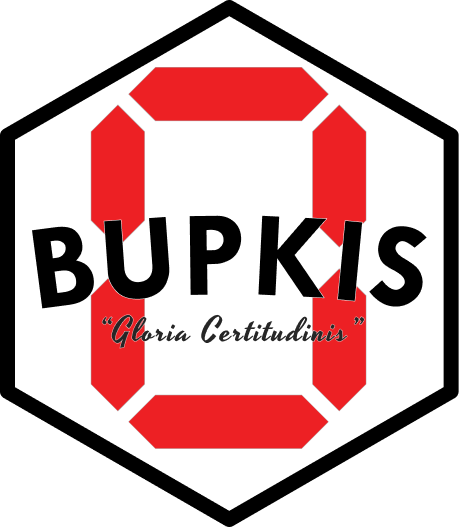

  
  <h1 align="center">⁓ BUPKIS ⁓</h1>
  

    <em>“Uncommonly Extensible Assertions for The Beautiful People”</em>
     
    <small>by <a href="https://github.com/boneskull" title="@boneskull on GitHub">@boneskull</a></small>
  

---

This is the monorepo for [**BUPKIS**][docs], the _uncommonly extensible assertion library._

## Packages

- **[bupkis](./packages/bupkis/)** - 🚨 The only _edible_ assertion library, **BUPKIS** 🚨

### Plugins

- **[@bupkis/events](./packages/events/)** - Event emitter assertions
- **[@bupkis/http](./packages/http/)** - HTTP response assertions
- **[@bupkis/msw](./packages/msw/)** - [MSW][] request verification assertions
- **[@bupkis/rxjs](./packages/rxjs/)** - [RxJS][] Observable assertions
- **[@bupkis/sinon](./packages/sinon/)** - [Sinon.JS][] spy/stub/mock assertions

### Migration Tools

- **[@bupkis/from-jest](./packages/from-jest/)** - Codemod to migrate Jest/Vitest assertions to **BUPKIS**

### Testing Tools

- **[@bupkis/property-testing](./packages/property-testing/)** - Property-based testing harness for **BUPKIS** assertions

## Resources

- [Official Documentation][docs]
- **BUPKIS** on [npm][]
- **BUPKIS** on [GitHub][]

## License

Copyright © 2025 [Christopher "boneskull" Hiller][boneskull]. Licensed under [BlueOak-1.0.0][].

[boneskull]: https://github.com/boneskull
[MSW]: https://mswjs.io
[RxJS]: https://rxjs.dev
[Sinon.JS]: https://sinonjs.org
[docs]: https://bupkis.zip
[npm]: https://www.npmjs.com/package/bupkis
[GitHub]: https://github.com/boneskull/bupkis
[BlueOak-1.0.0]: https://blueoakcouncil.org/license/1.0.0
