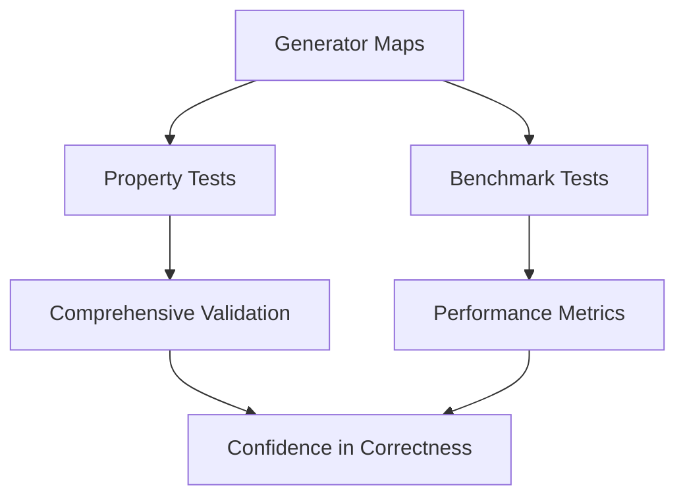

# Test Data Generators

This directory contains **fast-check arbitraries** for generating valid test data for all bupkis assertions. The test data is shared between **property-based tests** and **performance benchmarks**, ensuring consistency and correctness across the testing infrastructure.

## Overview

The test data generators serve two critical purposes:

1. **Property-Based Testing**: Generate diverse, valid inputs for comprehensive property testing
2. **Performance Benchmarking**: Provide realistic test data for accurate performance measurements

## Architecture

### Core Components

- **Generator Maps**: Each file exports a `Map<AnyAssertion, GeneratorParams>` linking assertions to their test data generators
- **Fast-Check Integration**: All generators use [fast-check][] arbitraries for deterministic, reproducible test data
- **Type Safety**: TypeScript ensures generator outputs match assertion input requirements

### File Structure

```plain
test-data/
├── README.md                      # This documentation
├── index.ts                       # Exports all generator maps
├── sync-basic-generators.ts       # Basic type assertions (string, number, boolean, etc.)
├── sync-collection-generators.ts  # Collection assertions (arrays, objects, Maps, Sets)
├── sync-date-generators.ts        # Date-related assertions
├── sync-esoteric-generators.ts    # Advanced assertions (instanceof, prototypes)
├── sync-parametric-generators.ts  # Parameterized assertions (greater than, contains)
└── async-parametric-generators.ts # Promise-based assertions
```

## Generator Types

### `GeneratorParams`

Generators can be defined in two formats:

1. **Array Format**: Tuple of individual arbitraries

   ```typescript
   [
     fc.string(), // Subject arbitrary
     fc.constantFrom('to be a string'), // Phrase arbitrary
     // ...additional parameter arbitraries
   ];
   ```

2. **Tuple Format**: Single arbitrary producing complete argument tuple

   ```typescript
   fc.tuple(
     fc.string(), // Subject
     fc.constantFrom('to be a string'), // Phrase
     // ...additional parameters
   );
   ```

### Example Generator

```typescript
// Basic string assertion generator
[
  assertions.stringAssertion,
  [
    fc.string(),                                    // Generate string subjects
    fc.constantFrom(...extractPhrases(assertions.stringAssertion)), // Valid phrases
  ],
]

// Parametric comparison generator
[
  assertions.greaterThanAssertion,
  [
    fc.integer(),                                   // Subject number
    fc.constantFrom('to be greater than'),          // Phrase
    fc.integer().map(n => n - 1),                   // Smaller comparison value
  ],
]
```

## Usage Patterns

### In Property Tests

Property tests use generators to create comprehensive test cases:

```typescript
// From property tests
const generators = SyncBasicGenerators.get(assertion);
if (generators) {
  fc.assert(
    fc.property(fc.tuple(...generators), (args) => {
      // Test assertion with generated arguments
      expect(...args);
    }),
  );
}
```

### In Benchmarks

Benchmarks sample generators for realistic performance testing:

```typescript
// From benchmarks
const testData = getTestDataForAssertion(assertion);
// testData is sampled from generators for consistent benchmarking
bench.add(`${assertion} [sync-function]`, () => {
  expect(...testData);
});
```

## Generator Design Principles

### 1. **Validity First**

Generators produce valid inputs that should make assertions pass:

```typescript
// String length generator - ensures subject has the specified length
[
  assertions.lengthAssertion,
  [
    fc.string().chain((s) => fc.constant(s)), // Subject string
    fc.constantFrom('to have length'), // Phrase
    fc.string().map((s) => s.length), // Matching length
  ],
];
```

### 2. **Phrase Extraction**

Uses `extractPhrases()` to get valid assertion phrases dynamically:

```typescript
fc.constantFrom(...extractPhrases(assertions.stringAssertion));
// Produces: 'to be a string' (and any alternative phrases)
```

### 3. **Coordinated Generation**

Complex assertions coordinate multiple parameters:

```typescript
// Range assertion - ensures subject is within the generated range
[
  assertions.withinAssertion,
  fc
    .tuple(
      fc.integer(), // Subject
      fc.constantFrom('to be within'), // Phrase
      fc.integer(), // Min value
      fc.integer(), // Max value
    )
    .chain(([subject, phrase, min, max]) => {
      const [actualMin, actualMax] = [Math.min(min, max), Math.max(min, max)];
      const validSubject = fc.integer({
        min: actualMin,
        max: actualMax,
      });
      return fc.constant([validSubject, phrase, actualMin, actualMax]);
    }),
];
```

### 4. **Filtered Generation**

Uses utility functions for constrained generation:

```typescript
// From property-test-util.js
filteredAnything; // Excludes problematic values (undefined, symbols, etc.)
filteredObject; // Generates plain objects only
filteredArray; // Generates arrays with filtered contents
```

## Generator Categories

### Basic Type Generators (`sync-basic-generators.ts`)

Test fundamental type checking assertions:

- `stringAssertion` → Generates strings for `'to be a string'`
- `numberAssertion` → Generates numbers for `'to be a number'`
- `booleanAssertion` → Generates booleans for `'to be a boolean'`
- `arrayAssertion` → Generates arrays for `'to be an array'`

### Collection Generators (`sync-collection-generators.ts`)

Test collection manipulation and querying:

- `containsAssertion` → Generates arrays containing specific elements
- `lengthAssertion` → Generates collections with specific lengths
- `emptyAssertion` → Generates empty collections
- `keyAssertion` → Generates objects with specific keys

### Parametric Generators (`sync-parametric-generators.ts`)

Test assertions requiring additional parameters:

- `greaterThanAssertion` → Generates number/value + smaller comparison
- `matchesAssertion` → Generates strings + matching RegExp patterns
- `throwsAssertion` → Generates functions + expected error types

### Async Generators (`async-parametric-generators.ts`)

Test Promise-based assertions:

- `resolvesAssertion` → Generates resolving Promises + expected values
- `rejectsAssertion` → Generates rejecting Promises + expected errors

## Integration Points

### Property Test Integration

The generators are consumed by property tests via:

1. **Assertion Discovery**: Tests iterate over generator maps
2. **Dynamic Test Generation**: Each assertion gets property tests auto-generated
3. **Variant Testing**: Multiple test configurations per assertion type

### Benchmark Integration

The generators feed into benchmarks through:

1. **Sampling**: `fc.sample()` extracts concrete test data
2. **Consistency**: Same generators ensure benchmarks test realistic scenarios
3. **Performance**: Pre-generated data avoids overhead during benchmarking

### Example Integration Flow



## Development Guidelines

### Adding New Generators

1. **Identify the assertion type** and target file
2. **Design coordinated generation** ensuring validity
3. **Use phrase extraction** for dynamic phrase selection
4. **Test both positive and edge cases** where appropriate
5. **Document complex generation strategies** with comments

### Generator Quality Checklist

- ✅ **Generates valid inputs** that make assertions pass
- ✅ **Uses `extractPhrases()`** for phrase selection
- ✅ **Coordinates parameters** when assertions have dependencies
- ✅ **Handles edge cases** appropriately
- ✅ **Avoids problematic values** using filtered generators
- ✅ **Provides good coverage** of the assertion's domain

## Fast-Check Resources

- [Fast-Check Documentation][fast-check]
- [Arbitrary API Reference](https://fast-check.dev/docs/core-blocks/arbitraries/)
- [Property-Based Testing Guide](https://fast-check.dev/docs/introduction/getting-started/)

---

The test data infrastructure ensures that both property tests and benchmarks work with realistic, valid data, providing confidence in both **correctness** and **performance** measurements.

[fast-check]: https://fast-check.dev
